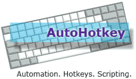
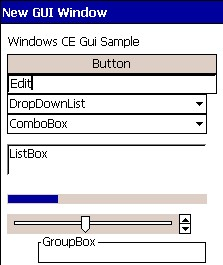

 Hi, here you can find a port of autohotkey for windows CE devices.

-   A lot of functions are working but there's a lot of work still
    undone.
-   Some things aren't working because wince does not support them
    (drive, recyclebin functions, environment...and others).
-   Some things must be rewritten because you need them on wince devices
    but they do not exist on win32 (tap and hold)

The main aim is to port most commands of ahk. New wince features are at
the end of the todo list.
 
The source code is from Autohotkey 1.0.48.02 but this does not mean
that everything is working yet.
03-04-10 Used Autohotkey\_L (unicode) as source.

How to start:
-------------

To make things easier for you there is a wince setup. The
AutohotkeyCE.exe (shrinked with upx so the exe is just 312 KB on the
file system) is wrapped with a cab file.

Just transfer the file to your CE device and run the cab file.
AutohokeyCE.exe is installed in the program folder: "/program
files/AutohotkeyCE/AutohotkeyCE.exe".

The installer automatically registers the ahk extension so you
can start your script directly just like on win32 systems.
To edit the script "pword" of the OS is used.

Please have a look at the [Working commands](WorkingCommands.pdf) (a pdf file)

A yet small list of "known" [working devices](WorkingDevices.md)

#### Downloads:

Unicode-Build 1.0.48.760:
[AutohotkeyCEUni.cab](bin/AutoHotkeyCEUni.CAB)

[Changelog](Changelog.md)
[TODO list](TODO.md)

* * * * *

The following ahk commands are not supported by the OS.

-   Drive: There are no drives on ce devices. The root starts with / and
    every file system is mounted there
-   Winset (Transparent, Transcolor): The api for WINSET does not exist
    on ce devices. There is a chance to rewrite the code to achive the
    same. 
-   The following system folders do not exist on ce devices: A\_appdata
    / A\_AppDataCommon / A\_AppData / A\_AppDataCommon /
    A\_DesktopCommon / A\_StartMenuCommon / A\_ProgramsCommon /
    A\_StartupCommon
-   EnvSet: There are no environment variables on ce devices
-   FileRecycle FileRecycleEmpty: No recycle bin found :-)
-   A\_TimeIdle/ A\_TimeIdlePhysical
-   RunAs: Are there users / groups on ce devices? I haven't found them
    on my PNA.
-   Get / SetWorkingDir: The concept of the current folder does not
    exist

\* a\_iscompiled ComSpec A\_Language  A\_IPAddress1-4  DllCall
RegisterCallback  FileInstall

* * * * *

#### Compiler:

Edit 09-06-09 Now the compiler is working. You can compile your script
directly on your device.

Edit 23-05-09 fincs sent me source code  for the functions in the
closed source dll. Now it's possible to compile a real ahk-compiler. In
the download file is just a windows 32 exe. You can launch it, compile
your script and transfer the resulting exe to the ce device. The
compiled exe should run.
 
You can compile windows 32 (ahk) text files or multibyte / unicode
files (0xfffe)

The compiler is included within the installer.\

[The long version](http://www.autohotkey.com/forum/viewtopic.php?p=260966#260966)
of the explaination.

* * * * *

...[some short information for developers](Developerinfo.md)

* * * * *

Thanks:

Chris for Autohotkey.
Titan for this webspace (autohotkey.net).
Fincs for the code needed to create a compiler.
Barry for his help, bugfixes, funcions and infos
Sergeich for his script to register the ahk extension
and all others who helps on the forum to answer questions.

Last change: 15-02-11
